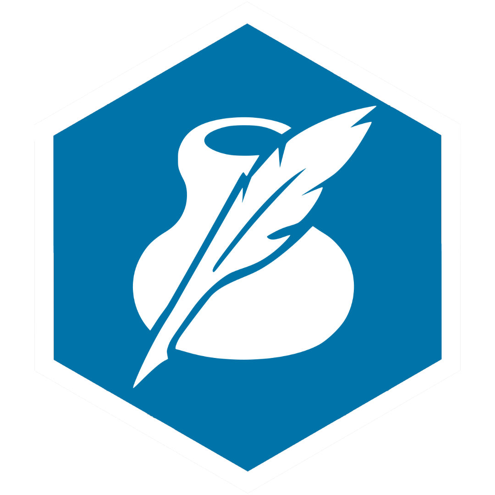

# Civ6Bot - Rating

**Civ6Bot Rating** provides game history and tools for rating. You can use it standalone or with other [Civ6Bot project](https://github.com/civ6bot/) Discord bots.
<br>
Current version: `1.1.4` (Leader Pass pt. 5, Great Builders pack).
You can [invite](https://discord.com/api/oauth2/authorize?client_id=795292082184650813&permissions=139855260737&scope=bot) bot to your Discord server.
<p align="center">
    
</p>

## <a name="requirements"></a>Requirements
* **npm** `16.x.x >= 16.14.2`
* **node** `9.x.x >= 9.4.0`
* [**rating.env**](./docs/env-rating.md) file with private keys and authorization data. (Click on link to see how to configure Dotenv file for Civ6Bot Rating)

## <a name="installation"></a>Installation
```bash
    [sudo] git clone https://github.com/civ6bot/rating
    [sudo] npm i
```

## <a name="usage"></a>Usage
* `npm run all` to build & run project;
* `npm run nodemon` to run with `nodemon` tool (auto-restart after any code changes).
<br/><br/>

## <a name="tools"></a>Tools & Technologies
* **[Node.js](https://nodejs.org/en/), [npm](https://www.npmjs.com/), [TypeScript](https://www.typescriptlang.org/);**
* **[nodemon](https://www.npmjs.com/package/nodemon);**
* **[discord.js](https://discord.js.org/#/), [DiscordX](https://www.npmjs.com/package/discordx);**
* **[Axios](https://www.npmjs.com/package/axios);**
* **[MySQL](https://www.npmjs.com/package/mysql), [SQLite (sqlite3)](https://www.npmjs.com/package/sqlite3), [TypeORM](https://typeorm.io/).**
<br/><br/>

## ❤️ Special thanks
Thanks to the patrons and Civilization VI community for donations and supporting. If you want to participate too, you can:
- donate for Website+VPS maintenance on [Patreon](https://www.patreon.com/civ6bot) or [Boosty](https://boosty.to/civ6bot);
- translate bot to other language (write PM to me to get lines and instructions);
- find and reports bugs;
- invite bot to your Discord server (you can find these bots on [Civ6Bot Discord server](https://discord.gg/CzCQPjxXTy));
- ... or just say "thank you" !
